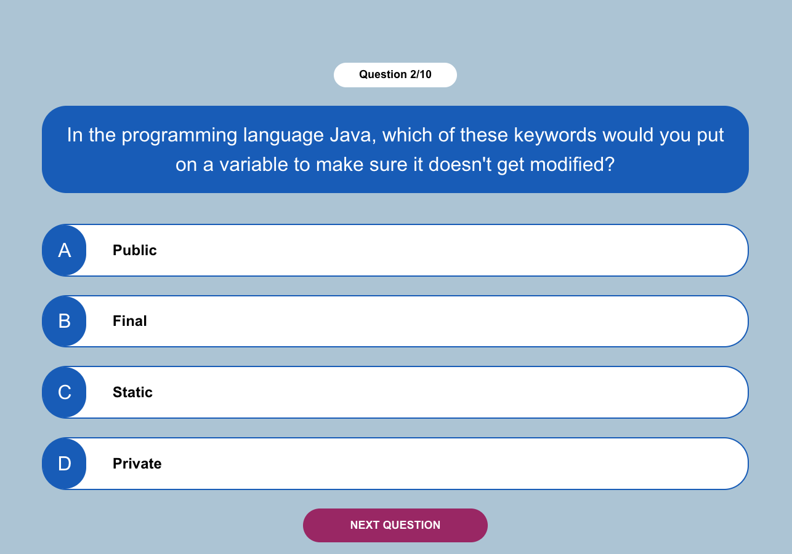

# React-quiz

[Click here to see deployed game](https://alexanderalexy.github.io/react-quiz/)

## Description
This is a React quiz project where users can answer questions.

## MVP
- Display questions
- Select answers
- Verify correct answer
- Track progress

## Backlog
- Add a timer for each question
- Save and display scores
- Introduce different difficulty levels
- Implement a highscore list
- Add an option to share results on social media

## Data structure
### Components
1. Question - Displays the current question and lists available answers.
2. Answer - Displays a single answer option.
3. Quiz - Controls the quiz flow and fetches questions from the server.
4. QuizContext and QuizProvider - Manage the game's state.

## States y States Transitions
- State 1: Start screen
- State 2: Displaying a question
- State 3: Showing results

### State Transitions:

- From State 1 to State 2: Clicking on "Start Game"
- From State 2 to State 2 (next question): Selecting an answer
- From State 2 to State 3: Completing the quiz

## Task
1. Improve styling of the user interface with CSS.
2. Add additional features as per the backlog.

## Links
- [Github repository Link](https://github.com/alexanderalexy/react-quiz)
- [Deployment Link](https://alexanderalexy.github.io/react-quiz/)
